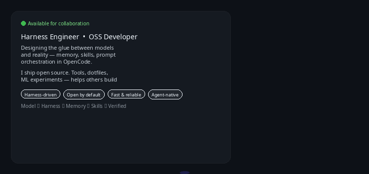

<p align="center">
  
</p>

<!-- ==================== BANNER ==================== -->
<p align="center">
  
</p>

<h1 align="center">👋 Hey, I'm Sankar</h1>
<h3 align="center">🔧 Harness Engineer &nbsp;•&nbsp; 🌍 OSS Developer &nbsp;•&nbsp; ⚡ Open Systems Builder</h3>

<p align="center">
  <a href="https://git.io/typing-svg"></a>
</p>

<p align="center">
  
  
  
  
</p>

<p align="center">
  <em>Building agent harnesses, memory & skill systems that make AI actually useful — in the open.</em>
</p>

---

## 🧠 About Me

<p align="center">
  
</p>

<details>
<summary><i>About Me — text version</i></summary>

**Harness Engineer** designing the glue between models and reality — memory, skills, prompt orchestration, and multi-agent workflows. I work in the <a href="https://opencode.ai">OpenCode</a> ecosystem building persistent harness infrastructure.

**OSS Developer** — I ship open source. Tools, dotfiles, ML experiments, and system configs. If it helps someone else build faster, it belongs in public.

**Previously:** Full Stack Developer & AI/LLM Engineer focused on RAG, vector databases, and AI SaaS. That foundation now powers harness-first architecture.

I build systems that are:
- 🧩 **Harness-driven** — composable skills & memory, not one-off prompts
- 🔓 **Open by default** — reproducible, forkable, documented
- ⚡ **Fast & reliable** — clean architecture, real-world performance
- 🤖 **Agent-native** — built for autonomous execution

</details>

---

## ⚙️ What I Do — Harness Engineering

> The model is the engine. The harness is the car.

**Memory & Context** — persistent memory stores, prompt notes, and context compression that survives across sessions

**Skills & Orchestration** — reusable skill definitions, subagent dispatch, and advisor → worker patterns for complex tasks

**Agent Systems** — RLM bridges, multi-agent coordination, verification gates, and production harness reliability

**Open Source Systems** — dotfiles, waybar configs, and dev tooling that make Linux + AI workflows reproducible

```text
Model  →  Harness  →  Memory  →  Skills  →  Verified Output
         (my focus)
```

---

## 🌍 Open Source

- 🔧 **Harness & Tooling** — OpenCode harness, RLM bridges, agent orchestration patterns
- 🐧 **Linux Systems** — `dotfiles` & `waybar-dotfile` — Hyprland setup, reproducible dev environment
- 🧪 **ML Experiments** — `image-accuracy-finder`, stock & house price prediction — practical AI, not demos
- 📚 **Always Shipping** — if I learn it, I open-source it

<p align="center">
  <a href="https://github.com/sankaroffzl?tab=repositories">
    
  </a>
</p>

---

## 🛠 Tech Stack

<p align="center">
  
  
  
  
</p>

<div align="center">

<table>
<tr>
<td align="center" width="50%" valign="top">

**💻 Languages**
<br/><br/>

<br/><br/>
<sub><b>TS</b> • <b>JS</b> • <b>Python</b> • <b>Lua</b> • <b>Bash</b> • <b>Go</b> • HTML • CSS</sub>

</td>
<td align="center" width="50%" valign="top">

**📚 Frameworks & Platforms**
<br/><br/>

<br/><br/>
<sub><b>React</b> • <b>Next.js</b> • <b>Node</b> • <b>Express</b> • <b>Tailwind</b> • <b>FastAPI</b></sub>

</td>
</tr>
<tr>
<td align="center" width="50%" valign="top">

**🗄 Databases & Vector**
<br/><br/>

<br/><br/>
<sub><b>PostgreSQL</b> • <b>MongoDB</b> • <b>Redis</b> • <b>Firebase</b></sub>

</td>
<td align="center" width="50%" valign="top">

**🧰 Harness, Tools & Cloud**
<br/><br/>

<br/><br/>
<sub><b>Git</b> • <b>GitHub</b> • <b>Linux</b> • <b>Arch</b> • <b>Docker</b> • <b>Neovim</b> • <b>VSCode</b></sub>

</td>
</tr>
</table>

</div>

<details>
<summary><b>🧰 Harness Stack Detail</b></summary>
<br>

- **Harness:** OpenCode, Agent Harness, Skills/Memory Store, RLM Bridge
- **Languages:** TypeScript • Python • Lua • Bash • Go — typed harness logic + system scripting
- **Frameworks:** React/Next.js (UI), Node/Express + FastAPI (APIs), Tailwind
- **Data:** PostgreSQL • MongoDB • Redis • Firebase — relational + vector/cache
- **Systems:** Arch Linux • Hyprland • Waybar • Ghostty • Neovim • Tmux • Zsh — dotfiles-driven reproducibility ([dotfiles](https://github.com/sankaroffzl/dotfiles))
- **Practices:** Verification-before-completion, Spec-driven dev, Git worktrees

</details>

---

## 📊 GitHub Analytics

<p align="center">
  
  
</p>

<p align="center">
  
</p>

<p align="center">
  
</p>

---

## 🚀 Current Focus

- 🔧 **Harness Engineering** — memory, skills, and orchestration for long-running agents
- 🌍 **Open Source Systems** — reproducible tooling that others can fork and extend
- 🤖 **Agent Reliability** — verification gates, context compression, failure recovery
- 🐧 **Linux + AI Workflows** — Hyprland, dotfiles, and local-first AI tooling
- 📖 **Building in Public** — documenting what I learn, as I learn it

---

## 🌐 Connect With Me

<p align="center">
  <a href="https://github.com/sankaroffzl">
    
  </a>
  <a href="https://linkedin.com/in/sankaranathan-d-09b3b0299">
    
  </a>
  <a href="https://instagram.com/sankxroffzl">
    
  </a>
  <a href="mailto:sankaranathan2762005@gmail.com">
    
  </a>
</p>

---

<p align="center">
  
</p>

## ❤️ Support My Work

<p align="center">
  <a href="https://www.buymeacoffee.com/">
    
  </a>
</p>

<p align="center">
  <sub>OSS Developer • Harness Engineer • Building open systems that outlive the hype.</sub>
</p>
